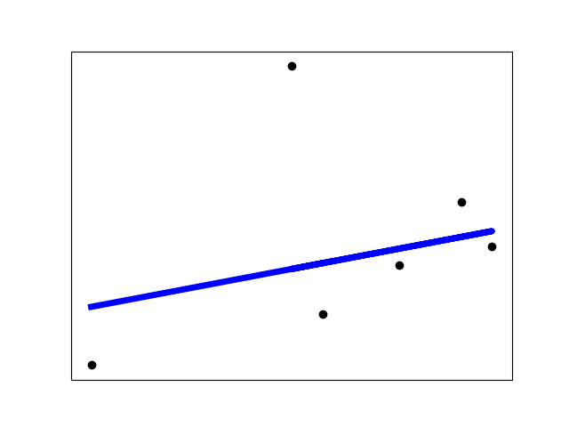

# Height-Weight Exercise by jsmateo  
Both models are based on the examples provided in the class repository, specifically:  
- [Supervised-Regression](https://github.com/biplav-s/course-d2d-ai/blob/main/sample-code/l6-l7-l8-supervised-ml/Supervised-Regression.ipynb)
- [Supervised-Regression-Classification](https://github.com/biplav-s/course-d2d-ai/blob/main/sample-code/l6-l7-l8-supervised-ml/Supervised-Regression-Classification.ipynb)

## custom-classifier-model  
Uses logistic regression to classify BMI into 4 categories, given height.  

### Model details  
intercept :  [ 0.14718054  0.18214376 -7.9748951   7.64557081]  
coeff :  [[-0.00824705] [ 0.00629849] [ 0.04789867] [-0.0459501 ]]  
### Confusion Matrix:  
[[2 0 0]  
 [3 0 0]  
 [1 0 0]]
## custom-regression-model  
Uses linear regression to predict weight given height . 

### Model details:
intercept :  -30.65326358105149  
coeff :  [0.66523949]  
### Training data stats:  
Mean Absolute Error: 20.62775609155806  
Mean Squared Error: 2192.8549358154924  
Root Mean Squared Error: 46.82792901480368  
### Test data stats:  
Mean Absolute Error: 14.392948494260487  
Mean Squared Error: 424.6068438186428  
Root Mean Squared Error: 20.60599048380453  

### Graph of results

